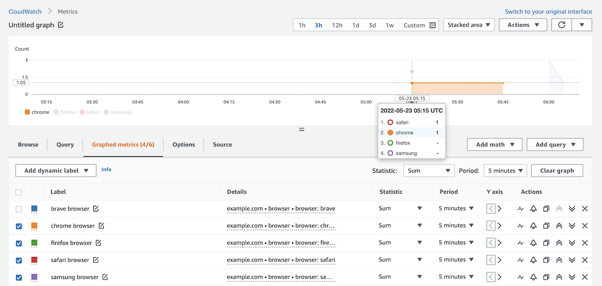

# Privian Web Analytics Server Example

This repo contains an example server for [Privian Web Analytics Script](https://github.com/privian/web-analytics) running on AWS Lambda and storing data into CloudWatch Metrics.

Our [web analytics](https://github.com/privian/web-analytics) script does most of the work, it sends a simple JSON payload with device information and pageviews. And this data can be easily stored in any database. This example uses CloudWatch as storage, because it already has charting UI and is cheap for small websites. You can also implement other types of storage.



## Deploy

1. Update the script `handler.js` with your domain names: 

```js
const allowedOrigins = [
  'example.com',
  'example2.com',
];
```

2. Install [Serverless](https://www.npmjs.com/package/serverless) and run:

```shell
serverless deploy
```

This will deploy a Lambda@Edge function. The output contains a CloudFlront URL, which is your `submitUrl` for the script.

## Charts

When using AWS console for charting, use `Sum` statistics function instead of the default average. This can be changed under "Graphed metrics".


## Cost estimate

For 1 million requests:

- Lambda@Edge takes about 400ms on average: $2.5/mo
- CloudWatch charges for PutMetricData: $10/mo
- CloudWatch charges for aprox. 13 metrics: $3.9/mo

Total: $16.4/mo

